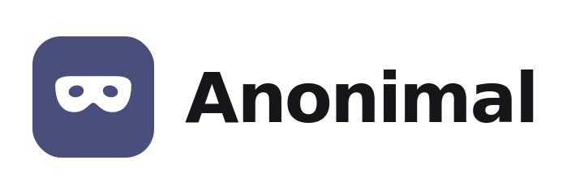

<p align="center">
  
</p>

<p align="center"><strong>Tus datos, anónimos. Sin salir de tu máquina.</strong></p>

Anonimal detecta y enmascara datos personales (PII) —nombres, mails, teléfonos,
direcciones, DNI/CUIT/CBU, tarjetas, secrets— **100% local**. No es una API en
la nube que *promete* no guardar tus datos: el modelo corre en tu CPU, offline,
y el dato directamente nunca sale.

Es el especialista en privacidad del ecosistema [Escriba](https://github.com/diegoparras/escriba)
(junto a Extracta y Fisherboy). Se usa solo o integrado.

> Estado: **v0.1.0 — Fase 0** (motor + API). La interfaz web, el CI y la
> documentación en 7 idiomas vienen en las próximas fases (ver `CHANGELOG.md`).

## Para qué sirve

- Mandar texto a un LLM (ChatGPT/Claude) sin filtrar datos personales.
- Limpiar datasets, logs, exports y transcripts antes de compartirlos.
- Compliance / legal / salud: datos sensibles que no pueden pasar por un SaaS.

## Dos motores

- **lite** (solo regex, sin modelo): liviano, offline, instala en cualquier lado.
  Detecta datos estructurados (mail, teléfono, tarjeta con Luhn, URL, IP,
  secrets) y LATAM (DNI, CUIT/CUIL con dígito verificador, CBU). No ve nombres
  ni direcciones libres.
- **ml** (OpenAI Privacy Filter): preciso para PII libre. Pesado (~6-7 GB,
  CPU-bound). Opcional.

`ANONIMAL_ENGINE`: `auto` (ML si está listo, si no lite) · `lite` · `ml`.

## Cinco modos

| Modo | Resultado | Reversible |
|---|---|---|
| `typed` | `[EMAIL]` | no |
| `anon` | `«REDACTADO»` | no |
| `pseudo` | `EMAIL_1` (seudónimo estable) | **sí** (guarda mapa) |
| `mask` | `j***@***.com` | no |
| `hash` | `EMAIL_a1b2c3d4e5` (determinista) | no |

**Reversibilidad:** el modo `pseudo` devuelve un mapa `token -> original`.
Anonimizás para mandar al LLM y des-anonimizás la respuesta con `/deanonymize`.

## Formatos

Anonimiza preservando el formato: `txt md log srt html`, **csv** (mantiene
columnas) y **json** (mantiene estructura y claves). Convertir Word/PDF/imágenes
no es tarea de Anonimal: eso lo hacen Escriba/Extracta/Fisherboy.

## API

| Método | Ruta | Qué hace |
|---|---|---|
| `GET` | `/health` | estado + disponibilidad del motor ML |
| `POST` | `/detect` | `{text}` → spans detectados |
| `POST` | `/anonymize` | `{text, mode, engine?}` → `{output, map, summary}` |
| `POST` | `/deanonymize` | `{text, map}` → texto original |
| `POST` | `/anonymize_file` | archivo + `mode` → contenido anonimizado |

## Correr

```bash
# Imagen liviana (solo regex), arranca al instante
docker compose --profile lite up anonimal-lite      # -> http://localhost:8921

# Imagen full (motor ML, ~6-7 GB, primera vez tarda)
docker compose up anonimal                           # -> http://localhost:8920

# Desarrollo local (motor lite, sin modelo)
pip install -r requirements.txt
uvicorn app.main:app --reload
python -m tests.run_tests                            # 18 tests
```

Ejemplo:

```bash
curl -s localhost:8921/anonymize -H "Content-Type: application/json" \
  -d '{"text":"escribile a juan@acme.com, CUIT 20-12345678-6","mode":"pseudo"}'
```

## Seguridad

Pensado para correr **local**. Si lo exponés: definí `ANONIMAL_TOKEN`
(se exige en cada request) y poné un reverse proxy con TLS adelante. Imagen
no-root, topes de tamaño (`ANONIMAL_MAX_CHARS`).

## Licencia

Apache-2.0. Usa [OpenAI Privacy Filter](https://github.com/openai/privacy-filter)
(Apache-2.0). © 2026 Diego Parras.
